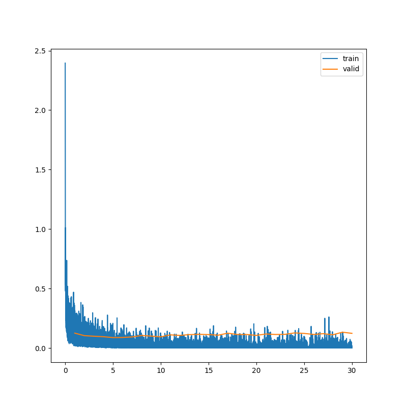

# Numpy MNIST

This project was done for the 02506 Advanced Image Analysis Spring 21 class by [RGring](https://github.com/RGring), 
[KathGran8](https://github.com/KathGran8) and [tillaczel](https://github.com/tillaczel). 
It is an implementation of a feed forward neural network in numpy for the MNIST image classification task.

## Running the experiment
1. Set the path to the test data in the config.yaml under *data.test*. (As default we have added the provided training data.)
2. Run the following command.
    ```
    python3 test.py
    ```
3. The accuracy is printed in the terminal.

## Results

Validation accuracy: 96.7%

